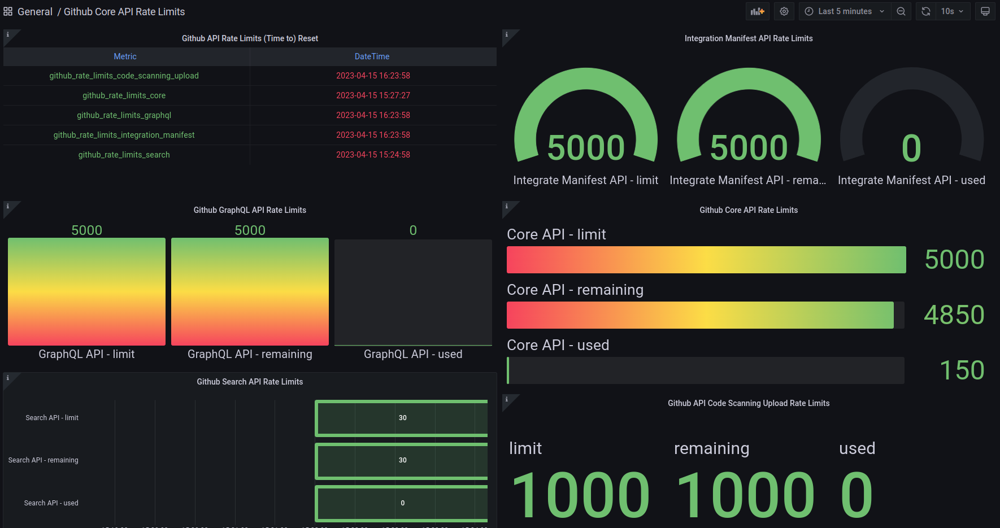

# github-rate-limits-exporter


[](https://github.com/theodore86/github-rate-limits-exporter/actions/workflows/container-build-test-and-publish.yml)
[](https://badge.fury.io/py/github-rate-limits-exporter)
[](https://img.shields.io/pypi/pyversions/github-rate-limits-exporter.svg)

Prometheus exporter to monitor the Github API rate-limits.



## Introduction

If you have ever tried using Github's API, you have probably already run into Github's rate limiting errors.</br>
Without authorization, Github only allows **60 requests per hour** (!!), and after creating and using your</br>
own personal access token, you are upgraded to *5000 requests per hour*.

That rate limit can be easily reached in just a few minutes by calling the API to list basic information from a medium</br>
sized repository and you would have **to wait 50+ minutes** for the rate limit to reset in order to continue or try again.</br>
You can up the rate limit to *15,000* with an enterprise account but the problem remains the same:

*If your service/program needs to make consistent and/or sustained requests to Github's APIs,</br>
you will have to work around and make the most of Github's rate limits.*

So, the *Prometheus Github rate-limits exporter* was introduced to expose the *remaining*, *used*, *limit*</br>
(quotas) and *reset* (rate-limit window resets in UTC seconds) information per Github API as metrics in order</br>
to create alerting events and (Grafana) monitoring dashboards.

For the exporter to fetch and expose the Github API rate-limits, you need to supply:

- a [GitHub Personal Access Token (PAT)](https://docs.github.com/en/authentication/keeping-your-account-and-data-secure/creating-a-personal-access-token)
- or [GitHub App (APP) credentials](https://docs.github.com/en/free-pro-team@latest/developers/apps/authenticating-with-github-apps).

## As standalone Python command line tool (pypi)

Install the tool through [pypi](https://pypi.org/project/github-rate-limits-exporter/):

```bash
pip3 install github-rate-limits-exporter
./github-rate-limits-exporter --help
```

## Tox (wrapper)

Clone the repository and install ``tox``:

```bash
pip install --user tox
```

### Run as ``PAT`` Github authentication type

```bash
tox -e run-exporter -- \
  --github-auth-type pat \
  --github-account my_account_name \
  --github-token my_token
```

### Run as ``APP`` (Github App) Github authentication type

```bash
tox -e run-exporter -- \
  --github-auth-type app \
  --github-account my_account_name \
  --github-app-id my_app_id \
  --github-app-installation-id my_installation_id \
  --github-app-private-key-path /path/to/private_key.pem
```

## Docker

Clone the repositroy and build the docker container image:

```bash
docker build -t prometheus-gh-rate-limit-exporter:latest .
```

or pull directly from [Docker Hub](https://hub.docker.com/r/theodore86/prometheus-gh-rate-limit-exporter):

```bash
docker pull theodore86/prometheus-gh-rate-limit-exporter:latest
```

### Run as PAT Github authentication type

```bash
docker run -p 10050:10050 -d \
  --name gh-rl-exporter \
  -e GITHUB_ACCOUNT=my_account_name \
  -e GITHUB_AUTH_TYPE=pat \
  -e GITHUB_TOKEN=my_token \
  -e GITHUB_LOG_LEVEL=4 \
  prometheus-gh-rate-limit-exporter:latest
```

### Run as APP (Github App) Github authentication type

```bash
docker run -p 10050:10050 -d \
  --name gh-rl-exporter \
  -e GITHUB_AUTH_TYPE=app \
  -e GITHUB_ACCOUNT=my_account_name \
  -e GITHUB_APP_ID=111111 \
  -e GITHUB_APP_INSTALLATION_ID=22222222 \
  -e GITHUB_APP_PRIVATE_KEY_PATH=/app/key.pem \
  -e GITHUB_LOG_LEVEL=4 \
  --mount type=bind,source=/ws/key.pem,target=/app/key.pem,readonly \
  prometheus-gh-rate-limit-exporter:latest
```

## Docker-Compose

Another way to test and observe the exporter is through the ``Prometheus/Grafana/AlertManager``</br>
stack on top of the [docker-compose](https://pypi.org/project/docker-compose/):

Clone the repository and install ``tox`` tool:

```bash
pip install --user tox
```

### Run as PAT Github authentication type

```bash
export GITHUB_AUTH_TYPE=pat
export GITHUB_TOKEN=your_token
export GITHUB_ACCOUNT=your_account
export GITHUB_LOG_LEVEL=4
export GF_SECURITY_ADMIN_USER=username
export GF_SECURITY_PASSWORD=password
tox -e dc-run
```

### Run as APP (Github App) authentication type

```bash
export GITHUB_AUTH_TYPE=app
export GITHUB_APP_ID=12345
export GITHUB_APP_INSTALLATION_ID=123456
export GITHUB_APP_SRC_PRIVATE_KEY_PATH=/ws/private_key.pem
export GITHUB_APP_PRIVATE_KEY_PATH=/tmp/private_key.pem
export GITHUB_LOG_LEVEL=4
export GF_SECURITY_ADMIN_USER=username
export GF_SECURITY_PASSWORD=password
tox -e dc-run
```

### Connect to Prometheus, Grafana and AlertManager:

- [Prometheus](http://localhost:9090)
- [Grafana](http://localhost:3000)
- [AlertManager](http://localhost:9093)

See also the existing examples:

- [Grafana dashboards](./monitoring/grafana/dashboards/sample.json)
- [Alertmanager rules](./monitoring/prometheus/rules/alerts.yml)

### Cleanup/teardown the composed services

```bash
tox -e dc-clean
```

## Other Projects

- [Github Rate Limits Exporter - written in GO](https://github.com/kalgurn/github-rate-limits-prometheus-exporter)

## References

- [creating-a-personal-access-token](https://docs.github.com/en/enterprise-server@3.4/authentication/keeping-your-account-and-data-secure/creating-a-personal-access-token)
- [creating-a-github-app](https://docs.github.com/en/free-pro-team@latest/developers/apps/creating-a-github-app)
- [installing-github-apps-in-your-organization](https://docs.github.com/en/free-pro-team@latest/github/customizing-your-github-workflow/installing-an-app-in-your-organization)
- [installing-github-apps-in-your-repository](https://docs.github.com/en/free-pro-team@latest/developers/apps/installing-github-apps)
- [how-to-get-most-out-of-github-api-rate-limits](https://www.endorlabs.com/blog/how-to-get-the-most-out-of-github-api-rate-limits)
